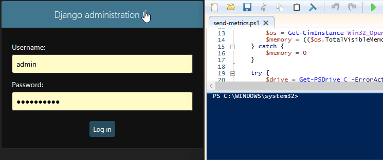

# Sysmon Web Panel

<p align="center">
  
  
  
  
</p>

<p align="center">
  
</p>

## Описание проекта
Инструмент для сбора и отправки системных метрик (CPU, память, диск) с хостов Windows в централизованное бэкенд-приложение на базе Django REST Framework.

## Технологии
* Python / Django REST Framework
* PowerShell / CIM / WMI

## Установка и запуск

1. Склонируйте репозиторий:
   ```bash
   git clone [https://github.com/MChuvilevM/sysmon-web-panel.git](https://github.com/MChuvilevM/sysmon-web-panel.git)
   ```

2. Запустите PowerShell-скрипт сбора метрик:
 ```
.\scripts\send-metrics.ps1
